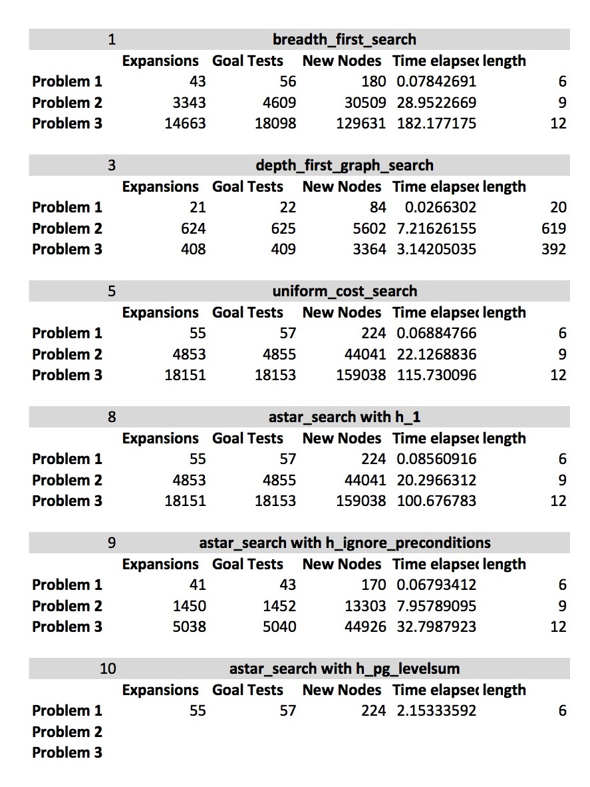

## Optimal Plans

### Problem 1 __Plan length: 6__

  * Load(C1, P1, SFO)
  * Fly(P1, SFO, JFK)
  * Load(C1, P1, JFK)
  * Load(C2, P2, JFK)
  * Fly(P2, JFK, SFO)
  * Load(C2, P2, SFO)

### Problem 2 __Plan length: 9__  

  * Load(C1, P1, SFO)
  * Fly(P1, SFO, JFK)
  * Load(C1, P1, JFK)
  * Load(C2, P2, JFK)
  * Fly(P2, JFK, SFO)
  * Load(C2, P2, SFO)
  * Load(C3, P3, ATL)
  * Fly(P3, ATL, SFO)
  * Load(C3, P3, SFO)

### Problem 3 __Plan length: 12__  

  * Load(C1, P1, SFO)
  * Fly(P1, SFO, ATL)
  * Load(C3, P1, ATL)
  * Fly(P1, ATL, JFK)
  * Load(C1, P1, JFK)
  * Load(C2, P2, JFK)
  * Fly(P2, JFK, ORD)
  * Load(C4, P2, ORD)
  * Fly(P2, ORD, SFO)
  * Load(C2, P2, SFO)
  * Load(C3, P1, JFK)
  * Load(C4, P2, SFO)

## Non-heuristic Search Comparison 
The trials tested problems 1, 2, and 3 with breadth first search, depth first graph search, and uniform cost search. On
a high level, breadth first search and uniform cost search finds the optimal solutions while depth first graph search
finds very quickly non-optimal solutions. Given the nature of the problem, which requires loading and flying planes,
having an optimal solution is key. By this logic, it makes sense to eliminate depth first graph search; it is not the
best algorithm for this problem. Between Uniform Cost Search and Breadth First Search, the two plans both had the same
output. However, uniform cost search was consistently faster. Based on the results shown in figure 1 below, Uniform Cost
Search was 12% faster for problem 1, 24% faster for problem 2, and 36% faster for problem 3. This leads me to believe
that generally, the more complex the problem is, the more of a margin there will be between these two search algorithm's
performance. What's the most interesting is that the expansions usually correlates positively with the elapsed time for
the algorithm. However, breadth first search on average had 30% less expansions than uniform cost search. Depth first
search had the least amount of expansions by a long shot. However, based on the design of the algorithm, this could vary
based on the data set. For this specific test, if memory was the key limiting factor (which it wasn't) then depth
first search would be a good solution. 

## Heuristic Search Comparison 
The three heuristic functions that were tested with the A\* algorithm were h1, ignore preconditions, and levelsum. The
first heuristic was basically a dummy heuristic that would have very similar results to running A\* without any
heuristics. The second heuristic was a simple heuristic that estimated the minimum number of levels the algorithm would
have to traverse to get to the solution. The third was the most complex heuristic that iterated through all the levels
to find the actual cost of the solution. The results showed that having a simple heuristic like ignore preconditions
improved the performance of the algorithm significantly (about 70% for problem 3). However, the ignore preconditions was
a good heuristic. On the other hand, levelsum heuristic was computationally expensive. Because of this, my computer was
not even able to find the solutions for problems 2 and 3. It took 32 times more seconds to complete problem 1 with the
levelsum heuristic than the ignorePrecondition heuristic. When looking at the same metrics as the non-heuristic search
comparison, it's clear that A\* with a good heuristic function (levelsum) is the best solution. The solution was just
as optimal, the expansions were much less than uniform cost search and bread first search, and the time was at least
three times faster. The conclusion is that a good heuristic function will make the algorithm much more efficient.
However, if the heuristic is computationally expensive, it would do more harm than good. : 

