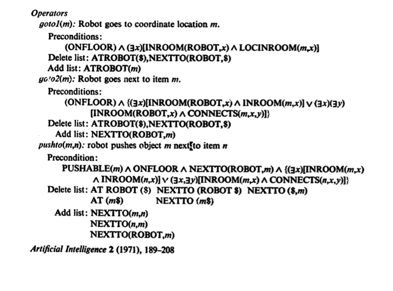

Planning, which can be loosely defined as finding a sequence of actions to reach a goal
state, is a major part of the field of Artificial Intelligence. What's interesting about
planing, is that it's roots go back beyond even the 1950s with Markovian Decision Process,
MDP (Bellman, R. (1957). While the initial thought processes were more theoretical based,
there were three key developments that allowed domain specific problems be represented in
computer models. The first is the STanford Research Institute Problem Solver or STRIPS
(1971 Files and Nilsson). The task of creating a language for planning problems needed to
be expressive enough to be able to solve general problems, however, there had to be strict
constrains so that algorithms could efficiently operate over them. Figure 1 depicts how
the language is able to be used as a general purpose problem solver for robotic tasks. 

Although STRIPS was very ground breaking, the restrictions imposed on it made it less
practical to use for some real problem spaces. For example, the language operated in a
closed world assumption (all unknowns are false) and all literals had to be positive.
The restrictions of STRIPS, led to the creation of The Action Description Language or ADL (Pednault, 1986). The ADL action representation, opened the gate for J. Scott Penberthy and Daniel S. Weld to to come up with UCPOP, the sound, complete, partial order planner (1992). 

Inspired by ADL, The Planing Domain Definition Language (PDDL) was introduced by at the Artificial Intelligence Planning System 1998 Competition (AIPS-98) (Ghallab, et. all 1998). According to the manual, the language has "the expressiveness of Pednault's ADL for propositions." The reason why PDDL is groundbreaking, is because it was the first attempt to standardize artificial intelligence planning languages. PDDL has many successors, and the latest version of PDDL3.1 and PDDL+ are still widely used today. The PDDL language can easily be parsed by computers which makes it a truly groundbreaking innovation. 

